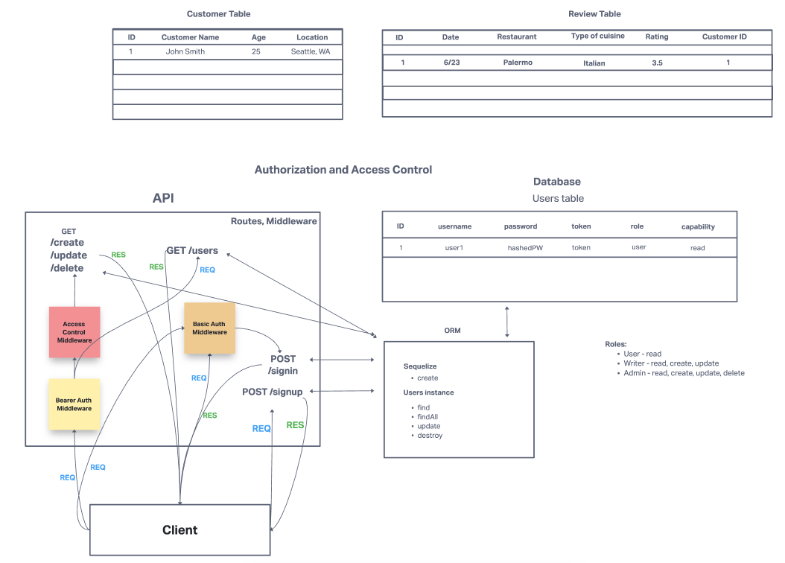

# LAB 09

## Project: auth-module-project-09

### Author: Elizabeth Hammes and Simon Son

### Problem Domain - Auth Module Lab 09 Project

* Create a new application using your API Server and Authentication System
* Your team will be responsible for planning, executing, and presenting an application that showcases an event driven architecture
* Requirements - Your application must employ the following programming concepts:
  * API/Auth server must be deployed
  * Use of your API server to perform database operations
  * Use of login/auth/acl to control access to your resources

### Links and Resources

- [ci/cd](https://github.com/ehammes/auth-module-project-09/actions) (GitHub Actions)
- [back-end server Heroku]() (Heroku) - TBD

### Setup

#### `.env` requirements (where applicable)

- `PORT` = port #
- `DATABASE_URL` = database URL
- `SECRET` = any text string

#### How to initialize/run your application (where applicable)

- nodemon

#### UML Diagram

#### How to use your library (where applicable)

Use the following thunder client collection for testing routes: [`thunder-collection_auth-module-project-09.json`](./thunder-collection_auth-module-project-09.json)

#### Features / Routes

Specific routes to hit

* POST : `/customer`
* GET : `/customer/:id`
* GET : `/customer`
* PUT : `/customer/:id`
* DELETE : `/customer/:id`

* POST : `/review`
* GET : `/review/:id`
* GET : `/review`
* PUT : `/review/:id`
* DELETE : `/review/:id`

* POST : `/signup`
* POST : `/signin`
* GET : `/users`

* GET : `/read`
* GET : `/create`
* GET : `/update`
* GET : `/delete`

#### Tests

* Run tests using `npm test`
